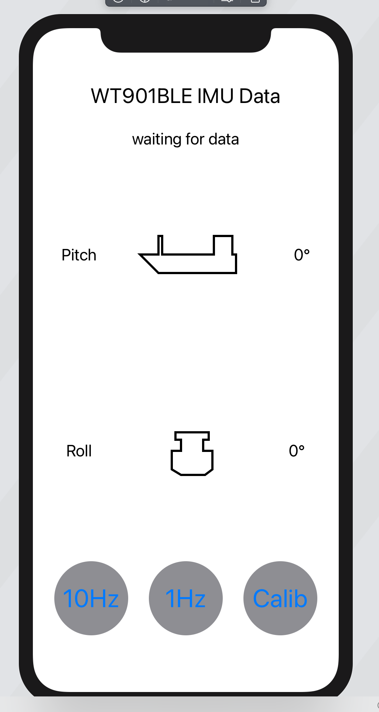

# WT901BLECL_Demo
iOS demo app to test the sensor

This app was built to find out how to interact with the WIT Motion WT901BLECL sensor.
The commands and data that the manufacturer documented were implemented and work.
https://drive.google.com/drive/folders/1NlOFHSTYNy2bRAfaA0S25BEaXK4uvia9

Problem to solve: sensor disconnects after about 90s. As google search shows, that may be releated to wrong timings of WIT's peripheral implementation. Waiting for response from them.

Update: They wrote that I should check out the iOS demo app and access the module like so. Did that - and found that it also disconnects after 90s. For now it's prooved that WIT has no iOS compatible device. At least not compatible to iOS 14.2 on iPhone 11. 

